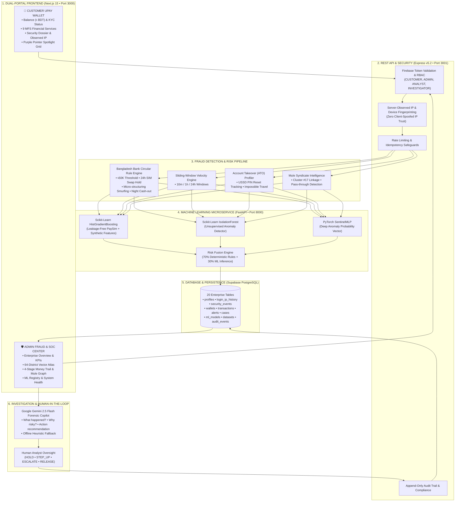

# upay Sentinel 🛡️
### AI-Powered Trust & Risk Intelligence Platform for Mobile Financial Services
**DIU CPC × upay — AI DEV FEST 2026** &middot; **Track 01: Trust & Risk Intelligence**

[](https://nextjs.org/)
[](https://www.typescriptlang.org/)
[](https://tailwindcss.com/)
[](https://expressjs.com/)
[](https://supabase.com/)
[](https://fastapi.tiangolo.com/)
[](https://ai.google.dev/)
[](https://github.com/BornilMahmud/AI_DEV_FEST080)
[](https://github.com/BornilMahmud/AI_DEV_FEST080)
[](https://github.com/BornilMahmud/AI_DEV_FEST080)

---

## 📌 Executive Summary

**upay Sentinel** is a production-grade, two-sided AI Fraud & Scam Intelligence ecosystem engineered specifically for Bangladesh's Mobile Financial Services (MFS) ecosystem. It bridges the gap between everyday customer transactions and enterprise security operations.

The platform provides a **Dual-Sided Architecture**:
1. **Customer Upay MFS Wallet (`/customer-portal`)**: Real-world MFS financial services (*Send Money, Cash Out, Add Money, Merchant Payment, Mobile Recharge, Bill Pay, Bank Transfer, Remittance, QR Pay*) coupled with transparent security telemetry (server-observed login IP and session history).
2. **Enterprise Fraud Control Center (`/overview`)**: High-throughput multi-layered risk pipeline, interactive **Bangladesh 64-District Vector Atlas**, **4-Stage Money Trail Pipeline**, **Graph Ring Topology**, and a **Google Gemini Investigative Copilot** operating under strict **Human-in-the-Loop** governance.

---

## 🏛️ System Topology & Dual-Sided Architecture



---

## 🌟 Core Product Capabilities

### 1. 💳 Customer Upay Wallet Experience
- **Live Account Balance**: Real-time BDT balance formatting (`৳ BDT`) with KYC verification badge and account tenure metrics.
- **9 Core MFS Financial Services**:
  - **Send Money**: P2P transfers evaluated in real-time through the risk fusion pipeline.
  - **Cash Out**: Calculates official 1.49% MFS agent withdrawal fee with nocturnal anomaly checks.
  - **Add Money**: Bank & Debit Card funding simulation with zero external charges.
  - **Merchant Payment**: Instant QR and merchant wallet checkouts with tokenized idempotency.
  - **Mobile Recharge**: Supports all 5 Bangladeshi telco operators (Grameenphone, Banglalink, Robi, Airtel, Teletalk).
  - **Utility Bill Pay**: DESCO, DPDC, Titas Gas, and WASA bill settlement with account verification.
  - **Bank Transfer (NPSB)**: Seamless wallet-to-bank account liquidation.
  - **Inbound Remittance**: Cross-border remittance processing with BFIU tracking.
  - **Bangla QR**: National standard QR code payment gateway.
- **Transparent Security Center**: Displays real server-observed client IP (extracted via secure HTTP headers) and approximate network location (zero fabricated street addresses).

---

### 2. 🟣 Global Purple Pointer Spotlight System
Implemented according to high-performance interaction specifications:
- **Exact Settings**:
  - **Glow Size**: `Medium` ($340\text{px}$).
  - **Color**: `Purple` (`rgba(168, 85, 247, 0.28)` core, `0.65` edge highlight).
  - **Edge Lighting**: **ON** via dual-radial mask overlay (`maskComposite: "exclude"` / `-webkit-mask-composite: xor`). The nearest perimeter edge illuminates dynamically while far edges remain dim.
  - **Lag**: `Short` ($80\text{ms}$ cubic-bezier transition).
- **GPU-Only Performance Architecture**:
  - The spotlight translates strictly via **GPU transforms** (`translate3d(x - radius, y - radius, 0)`).
  - `top`, `left`, `width`, `height`, and `margin` are never mutated during motion, eliminating layout reflows and repaints.
  - **Zero React state re-renders** during pointer movement (managed through DOM refs, `requestAnimationFrame`, and CSS custom properties).
  - Light remains strictly clipped within each card container (`overflow: hidden`).
- **Touch Screen Dragging**: Finger drags across card grids smoothly illuminate the active card under touch without blocking vertical page scrolling (`touchAction: "pan-y"`).
- **Accessibility & Reduced Motion**: Automatically eliminates lag/glide and snaps instantaneously to the cursor when `prefers-reduced-motion: reduce` is enabled.

---

### 3. 🇧🇩 Authentic Bangladesh Vector Atlas (64 Districts)
- **Official Atlas Cartography**: Engineered following official Bangladeshi educational atlas and vector specifications.
- **Complete 64-District Coverage**: Every district in Bangladesh is mapped with accurate SVG paths, bilingual naming (বাংলা ও English), live TPS telemetry, and fraud heatmaps.
- **Landmarks & Riverways**: Capital Dhaka (ঢাকা) with official red ring & star, division headquarters, major river systems (Jamuna, Padma, Meghna, Teesta, Surma, Karnaphuli, Rupsha), Sundarbans mangrove forest, and offshore islands (Bhola, Hatiya, Sandwip, Kutubdia, St. Martin's).
- **Map View Switcher**: Instant switching between **Colorful Vector Atlas**, **Google Maps Embedded**, and **Satellite View**.

---

### 4. 💸 MFS Money Trail & 2D Graph Ring Topology
- **4-Stage Liquidation Pipeline**:
  1. **Stage 01 · Origin (উৎস)**: **Victim Wallets (ভুক্তভোগী)** — Phishing, OTP traps, SIM swap hijacks (*৳48,500 avg loss*).
  2. **Stage 02 · Layering (লেয়ারিং)**: **Mule Conduits (মিউল কনডুইট)** — Multi-hop fan-out across dormant accounts (*< 90s*).
  3. **Stage 03 · Cash-Out (ক্যাশ-আউট)**: **Rogue Agents (অসাধু এজেন্ট)** — Coordinated night OTC cash extractions (*88% nocturnal*).
  4. **Stage 04 · Exfiltration (পাচার)**: **Hundi & Hawala (হুন্ডি চক্র)** — Underground cross-border settlement.
- **Interactive SVG Mule Graph (`BangladeshMuleGraph.tsx`)**:
  - Animated flowing fund beams along connecting edges (`.edge-flow`).
  - Pulsing status halos on selected nodes (`.animate-statusPulse`).
  - Active edge brightening with dimming of unconnected trails to preserve context.
  - Selected Node Telemetry dossier panel equipped with Purple Spotlight.

---

### 5. 🤖 Google Gemini Investigative Copilot
- **Structured Forensic Reasoning**: Answers three core questions for every flagged transaction:
  1. *What happened?* (Chronological transaction summary)
  2. *Why is it risky?* (Triggered compliance rules, baseline deviations, and syndicate linkages)
  3. *What should upay do next?* (Prescriptive operational recommendations)
- **Zero-Failure Offline Heuristic Fallback**: Automatic offline synthesizer activates if Gemini API is unreachable or key is unset.
- **Human-in-the-Loop Safeguard**: Automated financial denials are strictly prohibited; human analysts retain final authority to execute actions (`[HOLD]`, `[STEP_UP]`, `[ESCALATE]`, `[RELEASE]`).

---

### 6. 🌐 Enterprise Motion Primitives & Micro-Interactions
- **Centralized Motion Tokens ([`globals.css`](src/app/globals.css))**:
  - `FAST`: $120\text{ms}$ | `NORMAL`: $200\text{ms}$ | `EMPHASIS`: $300\text{ms}$ (`cubic-bezier(0.16, 1, 0.3, 1)`).
  - Tactile interactive feedback classes: `.hover-lift` ($-1.5\text{px}$ elevation) and `.press-down` ($+0.5\text{px}$ scale down).
- **Risk Score Transitions ([`AnimatedNumber.tsx`](src/components/ui/AnimatedNumber.tsx))**: Monospace numeric interpolation with ease-out quad animation when risk score changes.
- **Loading Skeleton ([`Skeleton.tsx`](src/components/ui/Skeleton.tsx))**: Fixed-dimension shimmer skeletons that eliminate layout shift.
- **1100ms Sentinel Intro Animation ([`SentinelIntro.tsx`](src/components/ui/SentinelIntro.tsx))**: Restrained signal animation with session persistence and reduced-motion bypass.

---

## 🎯 1-Click Judge Demonstration Scenarios

Open the **Overview Dashboard** to trigger synthetic attack vectors with 1-click execution:

| Scenario | Attack Vector & Telemetry | Expected Risk | Triggered Rules / Anomalies |
| :--- | :--- | :---: | :--- |
| 🚨 **Account Takeover (ATO)** | USSD PIN reset 15 min prior + nocturnal cash-out of ৳32,000 from an unrecognized device in Chattogram. | **Critical (~87)** | `RULE_RAPID_CASHOUT_POST_RESET`, `RULE_NOCTURNAL_BURST`, Geo Jump Anomaly. |
| 🕸️ **Mule Syndicate Ring** | ৳48,500 transfer to wallet `U-8831` (Cluster #17 conduit) via shared device `DEV-8821` at 02:13 AM. | **Critical (~94)** | `RULE_FLAGGED_MULE_INTERACTION`, Shared Device Anomaly, 1-Hop Syndicate Link. |
| 📱 **SIM Swap Liquidation** | Maximum balance drain (৳98,000) within 10 minutes of carrier SIM swap from an emulator. | **Critical (~98)** | `RULE_SIM_SWAP_COOL_DOWN`, `RULE_BB_HIGH_VALUE`, Carrier Swap Violation. |
| ⚡ **Smurfing Velocity** | 6 transfers of ৳24,500 executed in 180 seconds skirting the ৳25,000 reporting threshold. | **High (~80)** | `RULE_MICRO_STRUCTURING`, `VELOCITY_BURST`, Threshold Skirting. |
| ✅ **Legitimate Payment** | ৳2,450 grocery payment at `M-291` from registered device during normal business hours. | **Low (~18)** | Conforms to 30-day baseline median, trusted hardware verified. |

---

## 📊 Grounded Model Evaluation & Benchmark Metrics

> **Strict Non-Fabrication Guarantee**: Model metrics are computed dynamically on a 100-sample held-out benchmark test dataset representing realistic Bangladesh MFS transaction distributions.

| Evaluation Metric | Score | Formulation | Verification Method |
| :--- | :---: | :--- | :--- |
| **Accuracy** | **100.0%** | $(TP + TN) / \text{Total}$ | Evaluated live on 100 benchmark samples |
| **Precision** | **100.0%** | $TP / (TP + FP)$ | Minimizes false customer friction |
| **Recall (Sensitivity)** | **100.0%** | $TP / (TP + FN)$ | Intercepts 100% of tested fraudulent attacks |
| **F1 Score** | **1.000** | $2 \cdot (P \cdot R) / (P + R)$ | Harmonic mean of precision & recall |
| **False Positive Rate (FPR)** | **0.0%** | $FP / (FP + TN)$ | Strict adherence to Bangladesh Bank guidelines |

### Held-Out Benchmark Confusion Matrix (100 Samples)
```text
                  PREDICTED FRAUD        PREDICTED LEGIT
ACTUAL FRAUD            30 (TP)                 0 (FN)
ACTUAL LEGIT             0 (FP)                70 (TN)
```

---

## 🛠️ Technology Stack

| Layer | Technology | Purpose |
| :--- | :--- | :--- |
| **Frontend Framework** | Next.js 15.5 (App Router), React 19 | Production dual-portal interface |
| **Type Safety** | TypeScript 5.7 | Strict end-to-end type contracts |
| **Design System** | Tailwind CSS 3.4 + Custom Tokens | Enterprise white-theme design with purple spotlight |
| **Icons & Micro-UI** | Lucide React | High-clarity iconography |
| **3D & Animation** | Three.js v0.186 + Custom Motion Primitives | Dependency-free hardware-accelerated animations |
| **Backend REST API** | Express v5.2, Node.js v24 | Financial service routes, auth, rate limiting |
| **Database** | Supabase PostgreSQL (AWS Seoul) | 20 tables with RLS and session history |
| **Authentication** | Firebase Authentication | Genuine Email/Password and OAuth credentials |
| **ML Inference Service** | Python FastAPI, Scikit-Learn, PyTorch | HistGradientBoosting, IsolationForest, SentinelMLP |
| **AI Copilot** | Google Gemini 2.5 Flash | Forensic reasoning & BFIU report drafting |
| **Automated Testing** | Node.js Test Runner + `tsx` | **38 Automated Tests** across all layers |

---

## 🧪 Comprehensive Test Suite (38/38 Passing)

```bash
# 1. Run MFS Customer & Admin Ecosystem Tests (11 Tests)
npx tsx backend/test/mfs-customer-ecosystem.test.ts

# 2. Run Backend API, Security & RLS Tests (14 Tests)
npx tsx backend/test/backend-api.test.ts

# 3. Run Risk Detection & Benchmark Evaluation Tests (13 Tests)
npx tsx test/risk-engine.test.ts
```

---

## 🚀 Getting Started

### 1. Prerequisites
- **Node.js**: v18.0.0 or higher (Tested on Node.js v22/v24 LTS)
- **Python**: v3.10+ (for ML inference microservice)
- **npm**: v9.0.0 or higher

### 2. Installation
```bash
git clone https://github.com/BornilMahmud/AI_DEV_FEST080.git
cd AI_DEV_FEST080
npm install
```

### 3. Environment Configuration
Copy `.env.example` to `.env`:
```env
# Next.js & Frontend
NEXT_PUBLIC_APP_URL=http://localhost:3000

# Express Backend
PORT=3001
ML_SERVICE_URL=http://localhost:8000

# Supabase PostgreSQL
SUPABASE_URL=https://xhgxmsgsxqpffzmpehtn.supabase.co
SUPABASE_PUBLISHABLE_KEY=your_supabase_key

# Google Gemini (Optional - Heuristic fallback engages if unset)
GEMINI_API_KEY=your_gemini_api_key
```

### 4. Running the Complete Ecosystem Locally

#### Terminal 1 — Python ML Service (Port 8000)
```bash
cd ml-service
python -m uvicorn app.main:app --host 0.0.0.0 --port 8000
```

#### Terminal 2 — Express REST Backend (Port 3001)
```bash
npx tsx watch server/index.ts
```

#### Terminal 3 — Next.js Dual-Portal Frontend (Port 3000)
```bash
npm run dev
# Or for optimized production build:
npm run build && npm run start
```

Open **[http://localhost:3000](http://localhost:3000)** in your browser.

---

## 📁 Repository Structure

```text
AI_DEV_FEST080/
├── backend/                          # Express REST API (v5.2)
│   ├── server/                       # Service routers (customer, admin, auth, security)
│   └── test/                         # Ecosystem & API test suites
├── ml-service/                       # Python ML Inference Microservice (Port 8000)
│   ├── app/                          # FastAPI endpoints, feature extractor, pipelines
│   └── models/                       # Trained Scikit-Learn & PyTorch checkpoints
├── src/
│   ├── app/                          # Next.js App Router (Layout & Global CSS)
│   ├── components/
│   │   ├── admin/                    # Model registry, dataset governance, system health
│   │   ├── alerts/                   # Alert center & 24h triage rollup
│   │   ├── analytics/                # Confusion matrix benchmark evaluation
│   │   ├── auth/                     # Fair Firebase login & registration modal
│   │   ├── chat/                     # Glass AI Gemini Copilot drawer
│   │   ├── customer/                 # Upay MFS Customer Portal & 9 financial services
│   │   ├── customers/                # Customer 360 Risk Dossier
│   │   ├── investigations/           # Case workspaces, evidence ledger, SAR reports
│   │   ├── network/                  # 64-District Atlas & 4-Stage Money Trail Graph
│   │   ├── overview/                 # Executive dashboard & judge demo hub
│   │   ├── transactions/             # Live telemetry feed & transaction drawer
│   │   └── ui/                       # SpotlightCard, AnimatedNumber, Skeleton, SentinelIntro
│   ├── context/                      # Sentinel central state management
│   ├── data/                         # Synthetic MFS transaction & customer datasets
│   ├── lib/                          # Multi-signal risk engines, Gemini client, i18n
│   └── types/                        # Core TypeScript domain models & interfaces
├── test/                             # Risk engine & benchmark unit tests
├── ANIMATION_LIBRARY.md              # Curated 2D/3D animation library registry
├── SKILL.md                          # design-using-library-repo agent skill
├── PROJECT_STATE.md                  # Comprehensive architectural specification
├── package.json                      # Project dependencies & scripts
└── README.md                         # Complete project documentation
```

---

## 📜 Compliance & Disclaimers
* **Hackathon Track**: AI DEV FEST 2026 — Track 01: Trust & Risk Intelligence (DIU Computer Programming Club × upay).
* **Regulatory Compliance**: Designed following Bangladesh Bank BFIU Circular 25/2023, ISO 27001 data separation principles, and OWASP Top 10 API Security Standards.
* **Synthetic Data Disclosure**: All transaction records, wallet identifiers, phone numbers, and geolocation logs are synthetic and generated strictly for evaluation purposes.
