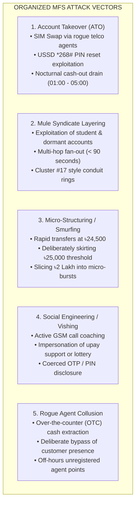

# 01. Problem Statement — The MFS Fraud Crisis in Bangladesh

---

## 1. Context: The Bangladesh MFS Landscape

Mobile Financial Services (MFS) are the lifeblood of Bangladesh's digital economy. With over **120 million registered wallets** and daily transaction volumes surpassing **৳4,000+ Crore**, platforms like **upay**, bKash, and Nagad have enabled financial inclusion for millions of previously unbanked citizens.

However, this hyper-velocity growth has also created an expansive attack surface for organized financial crime syndicates.

---

## 2. Core Fraud Vectors in Bangladesh MFS

Organized cyber syndicates exploit specific behavioral, infrastructural, and regulatory vulnerabilities unique to Bangladesh:

### Specific Threat Profiles:
1. **Account Takeover (ATO) & SIM Swap**:
   - Fraudsters bribe carrier field agents to execute an unauthorized SIM swap.
   - The victim's phone loses network connectivity while the attacker dials USSD codes (`*268#`) to reset the wallet PIN.
   - Within 15 minutes, the victim's wallet balance is wiped out via nocturnal cash-outs from unrecognized hardware.
2. **Mule Syndicate Ring Operations**:
   - Stolen funds are not held in the attacker's wallet; they are immediately fanned out across 5–10 intermediary "mule" accounts (frequently rented student accounts or dormant rural accounts).
   - Funds hop across 4 to 6 intermediary nodes in under 90 seconds before human analysts can react.
3. **Micro-Structuring (Smurfing)**:
   - Bangladesh Bank guidelines mandate enhanced due diligence and Currency Transaction Reporting (CTR) for transactions exceeding ৳50,000.
   - Syndicates use automated scripts to execute bursts of ৳24,500 transfers every 30 seconds, skirting regulatory tripwires while draining millions.
4. **Social Engineering with Active Call Coaching**:
   - Attackers maintain an active cellular call with vulnerable victims, guiding them step-by-step through the upay app or USSD menus under high psychological pressure.

---

## 3. Why Existing Solutions Fail

| Legacy Approach | Core Vulnerability | Consequence in Production |
| :--- | :--- | :--- |
| **Static Rule Engines (If/Else)** | Rigid threshold checking (e.g., `amount > 50000`). | Cannot detect dynamic velocity smurfing (e.g., 6 × ৳24,500). High false-positive rate freezes legitimate merchants. |
| **Naive LLM Black Boxes** | Submitting raw transactions directly to LLMs for automated blocking. | **Hallucinatory decisions**, latency of 2,000ms+ (violating sub-second settlement SLA), and violation of regulatory transparency rules. |
| **Siloed Investigation Tools** | Analysts toggle across separate database viewers, Excel logs, and network tables. | Average triage time exceeds **45 minutes per case**, allowing mule syndicates to exfiltrate cash before intervention. |
| **Non-Compliant Audit Trails** | Mutable logs in standard application databases. | Inability to satisfy **Bangladesh Bank (BB)** and **BFIU** forensic scrutiny during regulatory audits, risking operating license suspension. |

---

## 4. The Challenge Solved by upay Sentinel

**upay Sentinel** was engineered to solve three non-negotiable operational requirements:
1. **Speed & Determinism**: Intercept attacks in sub-milliseconds without adding latency to legitimate transactions.
2. **Explainability & Context**: Provide analysts with visual evidence (money trail, district map, feature attributions) rather than opaque risk scores.
3. **Regulatory Governance**: Enforce strict human-in-the-loop oversight with cryptographic, tamper-evident audit chaining compliant with BFIU standards.
