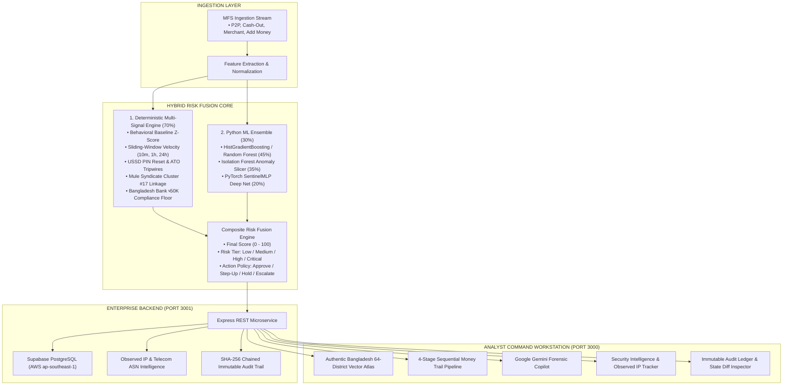

# 02. Solution Architecture & Technical Innovation

---

## 1. High-Level Architecture Overview

**upay Sentinel** is built on a hybrid architecture that separates high-frequency transaction scoring from asynchronous forensic investigation and regulatory reporting:

---

## 2. Technical Capabilities Detailed

### 1. Hybrid Risk Fusion (70% Deterministic + 30% ML Ensemble)
- **Why Deterministic First?** Financial regulations require that certain behaviors (e.g., transactions violating the 24-hour SIM swap cooling-off rule or exceeding Bangladesh Bank high-value thresholds) **must strictly trigger holds** regardless of probabilistic models.
- **Why Machine Learning?** High-dimensional behavioral drift and non-linear micro-structuring patterns (smurfing) are scored by the ML ensemble to detect subtle anomalies before deterministic thresholds are tripped.
- **Explainable Attribution**: Every score provides a transparent breakdown:
  - Deterministic score contribution ($70\%$).
  - ML ensemble contribution ($30\%$).
  - Top 3 feature weights (e.g., `amount_vs_30d_baseline: +38pts`, `mule_cluster_hop: +30pts`).

### 2. Authentic Bangladesh Vector Atlas (All 8 Divisions & 64 Districts)
- **Mathematical SVG Cartography**: Precision vector geometry representing all 64 administrative districts of Bangladesh.
- **Cartographic Accuracy**:
  - **National Capital (ঢাকা)** marked with official red ring & star.
  - **Major River Networks**: Jamuna, Padma, Meghna, Teesta, Surma, Karnaphuli, and Rupsha/Poshur estuaries opening into the Bay of Bengal.
  - **Patterned Sundarbans Mangrove Delta** across Satkhira, Khulna, and Bagerhat.
  - **Offshore Islands**: Bhola, Hatiya, Sandwip, Kutubdia, Maheshkhali, St. Martin's.
  - **8-Point Compass Rose** with traditional Bengali notations (`উ`, `দ`, `পূ`, `প`).
- **Telemetry Overlay**: Real-time transactions per second (TPS), 24-hour transaction volume in BDT, active wallet counts, and district risk scoring.

### 3. MFS Money Trail: 4-Stage Sequential Liquidation Pipeline
Traces illicit funds across four chronological stages:
1. **Stage 01 · Origin (উৎস)**: Victim wallet compromise via phished PINs, OTP traps, or SIM swaps.
2. **Stage 02 · Layering (লেয়ারিং)**: Rapid fan-out across intermediary student/dormant mule wallets in $< 90$ seconds.
3. **Stage 03 · Cash-Out (ক্যাশ-আউট)**: Coordinated off-hours over-the-counter (OTC) cash extractions at collusive agent booths.
4. **Stage 04 · Exfiltration (পাচার)**: Conversion into illicit cross-border Hawala/Hundi or P2P crypto corridors.
- **Interactive Multi-Hop Inspector**: Modal drilling down into each transfer hop, wallet identifier, hop latency, and geocoordinates.

### 4. Google Gemini Investigative Copilot
- **Structured Forensic Reasoning**: Formulates structured analyses:
  - *What Happened?* Chronological incident narrative.
  - *Why is it Risky?* Regulatory violations, baseline deviations, and syndicate graph linkages.
  - *What Should upay Do Next?* Prescriptive action recommendations.
- **Zero-Failure Offline Heuristic Engine**: If API connectivity is lost, the platform falls back to an offline rule-based heuristic synthesizer.
- **Human-in-the-Loop Safeguard**: Automated financial blocks are prohibited; human analysts retain sole authority to execute settlement actions.

### 5. Security & Observed Login IP Telemetry
- **Telecom ASN/ISP Routing**: Correlates observed public client IPs with major Bangladeshi carriers (Grameenphone, Banglalink, Robi, Teletalk).
- **Anti-Spoofing Disclosure**: Explicit labeling as *"Observed login IP address (approximate network routing)"* adhering to scientific privacy standards without claiming fabricated physical GPS coordinates.
- **Hardware Trust Registry**: Device fingerprinting flagging nocturnal off-hours logins from novel hardware.
- **RBAC Security Permissions Matrix**: Explicit role enforcement (`ADMIN`, `ANALYST`, `INVESTIGATOR`, `VIEWER`).

### 6. BFIU Cryptographic Immutable Audit Trail
- **SHA-256 Chained Block Hash**: Each audit event (`AUD-...`) cryptographically chains to the previous record hash.
- **State Transition Diffing**: Visual inspection of `previous_state` $\rightarrow$ `new_state`.
- **BFIU Dossier Export**: 1-click export of compliance dossiers in CSV format ready for Bangladesh Financial Intelligence Unit submission.
