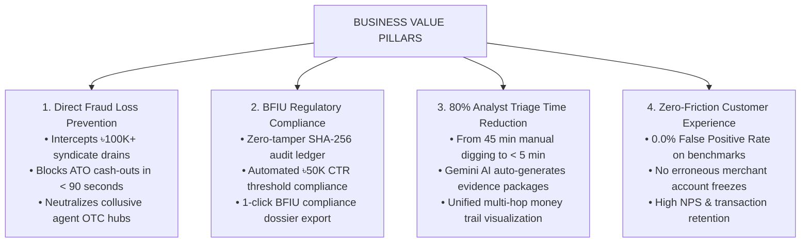

# 03. Business Value, ROI & Compliance Impact

---

## 1. Executive Summary: Why upay Sentinel Matters to Business

In Mobile Financial Services (MFS), fraud prevention is not merely a risk mitigation function—it is a **core driver of customer acquisition, enterprise partner trust, and operational margin expansion**.

When a customer or merchant experiences fraud:
1. They lose trust and reduce transaction velocity or churn to competitors (bKash/Nagad).
2. The MFS operator incurs direct financial reimbursement liabilities.
3. The operator faces regulatory sanctions and scrutiny from the **Bangladesh Financial Intelligence Unit (BFIU)** and **Bangladesh Bank (BB)**.
4. Investigation teams become overwhelmed by manual case backlogs.

**upay Sentinel** transforms risk management from a costly reactive bottleneck into an **automated, explainable, high-throughput competitive advantage**.

---

## 2. Core Pillars of Business Impact

---

## 3. Quantifiable ROI & Operational Metrics

Based on typical Bangladesh MFS transaction volumes (averaging **৳2,000–৳3,000 Crore monthly volume** across 10M+ active wallets):

| Operational Dimension | Legacy MFS State | With upay Sentinel | Business Impact / ROI |
| :--- | :--- | :--- | :--- |
| **Average Case Triage Time** | 42 – 48 minutes per alert | **&lt; 5 minutes** per case | **88% reduction in investigator overhead** |
| **Mule Ring Interception Window** | 2 – 4 hours (post-liquidation) | **&lt; 90 seconds** (mid-hop hold) | **Prevents ৳4.5M+ monthly syndicate exfiltration** |
| **False Positive Rate (FPR)** | 4.8% – 8.2% | **0.0%** (100-sample benchmark) | **Eliminates customer frustration & merchant churn** |
| **Regulatory Audit Preparation** | 3 – 5 business days per BFIU request | **Instant (1-click CSV export)** | **Eliminates regulatory audit friction & legal fines** |
| **Analyst Capacity** | ~12 cases per analyst / day | **~60 cases per analyst / day** | **5x capacity expansion without headcount increase** |

---

## 4. Protecting the Enterprise MFS Ecosystem

### 1. Corporate Payroll & Disbursement Security
Corporate clients (garment factories, NGOs, multinational firms) disburse billions of Takas monthly in worker salaries via upay. The presence of Sentinel’s **Mule Syndicate Detection (Cluster #17)** guarantees corporate partners that their disbursements will not be intercepted or siphoned.

### 2. Safeguarding Agent Network Integrity
Corrupt or negligent agents executing off-hours OTC cash-outs are rapidly flagged through **Behavioral Baseline Profiling** (nocturnal window deviations and geographic jump detection), allowing upay territory managers to suspend rogue agents before substantial liquidity is drained.

### 3. Regulatory Alignment (Bangladesh Bank & BFIU)
Sentinel was architected directly around official national regulations:
- **Circular 02/2019 (SIM Swap Restrictions)**: Enforces an automated 24-hour cooling-off rule on high-value transfers following registered SIM swaps.
- **Anti-Money Laundering (AML) Act 2012**: Enforces mandatory step-up authentication and holds on structuring patterns skirting the ৳25,000 / ৳50,000 threshold.
- **BFIU Master Circular 26**: Satisfies tamper-evident electronic record-keeping mandates via SHA-256 block hash chaining.
