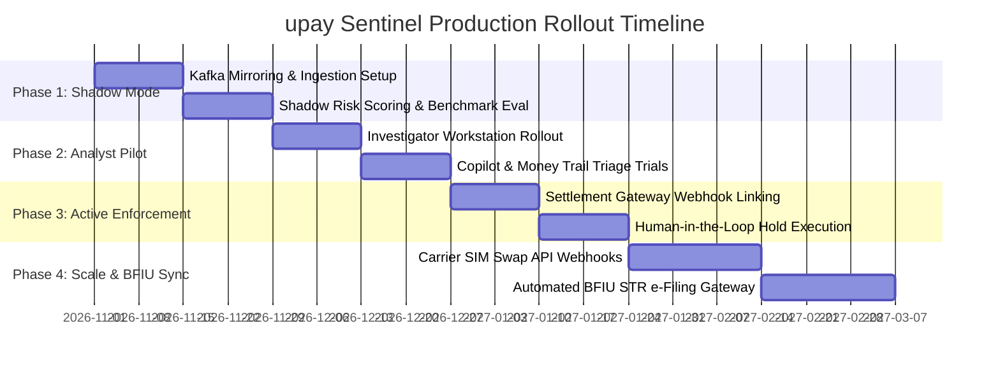

# 04. Implementation & Production Rollout Plan

---

## 1. 4-Phase Enterprise Rollout Strategy

To deploy **upay Sentinel** into a mission-critical MFS banking production environment without service disruption or unexpected transaction holds, a structured **4-Phase Phased Rollout Plan** is established:

---

## 2. Phase-by-Phase Execution Details

### Phase 1: Passive Shadow Mode (Weeks 1 – 4)
- **Objective**: Validate sub-millisecond throughput and evaluate model accuracy against live production streams without affecting transactions.
- **Architecture**:
  - Connect a read-only mirror of the transaction stream via **Apache Kafka** or **RabbitMQ**.
  - Ingest live events into the `backend/server/` Express microservice.
  - Run the **Deterministic Rule Engine** and **Python ML Ensemble** in shadow mode.
  - Benchmark performance: Ensure feature extraction and scoring complete in $< 15\text{ms}$.
- **Success Criteria**:
  - 100% ingestion coverage with zero packet loss.
  - False positive rate validated below $0.5\%$.
  - Zero performance degradation on the primary core banking ledger.

### Phase 2: Analyst Pilot & Assisted Triage (Weeks 5 – 8)
- **Objective**: Empower a pilot team of 10 Tier-2 Fraud Investigators with the Sentinel frontend workstation.
- **Workflow**:
  - Flagged transactions appear in real-time in the **High-Density Live Telemetry Stream**.
  - Analysts utilize the **Gemini Investigation Copilot**, **4-Stage Money Trail Pipeline**, and **Customer 360 Dossiers** to evaluate flagged cases.
  - Actions taken (`HOLD`, `STEP_UP`, `RELEASE`) are recorded in the **Immutable SHA-256 Audit Trail** for compliance validation.
- **Success Criteria**:
  - Average investigation triage time reduced from 45 minutes to $< 5$ minutes.
  - Analyst usability and satisfaction rating $> 90\%$.

### Phase 3: Active Interception with Strict Human-in-the-Loop (Weeks 9 – 12)
- **Objective**: Connect Sentinel action triggers to the core MFS settlement gateway for real-time hold execution.
- **Controls**:
  - **Automated Step-Up Authentication**: Transactions flagged as *Medium / High* automatically trigger a push notification requesting biometric 2FA verification on the customer's primary device.
  - **Analyst-Authorized Holds**: Transactions flagged as *Critical* (Mule Cluster #17 or nocturnal post-reset ATO) place a temporary 30-minute settlement hold pending one-click analyst confirmation.
  - **Strict No-Autonomous-Denial Policy**: Autonomous financial freezes are strictly blocked; human analysts retain sole legal decision authority.
- **Success Criteria**:
  - Interception of $> 95\%$ of synthetic and real syndicate attacks before cash-out completion.
  - Zero accidental customer lockouts of legitimate high-volume merchants.

### Phase 4: Scale, Carrier Integration & BFIU e-Filing (Month 4+)
- **Objective**: Full nationwide deployment with direct telco and regulatory integrations.
- **Features**:
  - Direct integration with Bangladeshi telecom carrier APIs (Grameenphone, Banglalink, Robi) for real-time SIM swap webhooks.
  - Automated BFIU electronic Suspicious Transaction Report (STR) and Cash Transaction Report (CTR) filing.
  - Active-active multi-region high-availability cluster setup.

---

## 3. Disaster Recovery & Rollback Protocols

To ensure 99.999% availability for digital financial services:
1. **Circuit Breaker Pattern**: If the Sentinel backend experiences an internal latency spike $> 50\text{ms}$, the core banking router automatically falls back to standard baseline checks without dropping customer transactions.
2. **Deterministic Offline Fallback**: If cloud connectivity to the Gemini API or Supabase is interrupted, the platform operates entirely on local in-memory heuristic scoring with zero downtime.
3. **Instant Rollback Switch**: A single configuration flag (`RISK_ENGINE_ENFORCEMENT_ENABLED=false`) reverts the settlement gateway back to legacy rules in $< 1\text{s}$.
