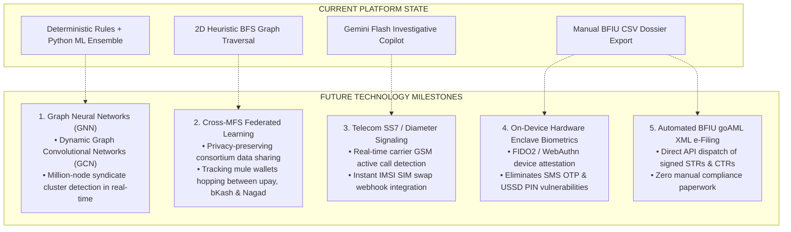

# 05. Future Improvements & Technology Roadmap

---

## 1. Vision: The Next Evolution of MFS Trust Intelligence

While **upay Sentinel** provides a production-grade detection and triage engine today, modern cybercrime syndicates continuously evolve. The following architectural advancements represent the future innovation roadmap for the platform.

---

## 2. Strategic Roadmap Details

### 1. Dynamic Graph Neural Networks (GNNs)
- **Current State**: Shortest hop distance and syndicate cluster linkages are computed via fast in-memory BFS graph traversals.
- **Future Milestone**: Deploy a distributed **Graph Convolutional Network (GCN)** on **Neo4j** or **AWS Neptune**. This will compute structural node embeddings across tens of millions of historical transactions, identifying complex circular layering patterns and smurfing rings that are invisible to linear queries.

### 2. Privacy-Preserving Cross-MFS Federated Learning
- **Current State**: Detection is scoped to the upay transaction network.
- **Future Milestone**: Fraud syndicates systematically hop between different MFS operators (e.g., cashing in via Bank, transferring via upay, and extracting via bKash/Nagad). We propose establishing a **National MFS Federated Intelligence Consortium**. Using differential privacy and secure multi-party computation (SMPC), all MFS operators train a unified fraud detection model without sharing customer identities or proprietary business data.

### 3. Real-Time Telecom SS7 Active Call Detection
- **Current State**: Social engineering detection is inferred from transaction timing, recipient novelty, and user hesitation metrics.
- **Future Milestone**: Partner with the **Bangladesh Telecommunication Regulatory Commission (BTRC)** and mobile operators (Grameenphone, Banglalink, Robi) to query the carrier SS7/Diameter signaling plane. If a high-value transfer is initiated while an active voice call is in progress with an unrecognized phone number, Sentinel automatically triggers a mandatory anti-coaching warning and temporary cooling-off delay.

### 4. Hardware Secure Enclave & FIDO2 Biometric Attestation
- **Current State**: Authentication relies on USSD PINs, SMS OTPs, and app passwords.
- **Future Milestone**: Shift primary authorization from vulnerable 4-digit PINs and SMS OTPs to hardware-bound cryptographic keys using **FIDO2 / WebAuthn** and on-device **Secure Enclaves** (Face ID / Fingerprint hardware). This renders phishing, SIM swap interception, and social engineering attacks virtually ineffective.

### 5. Automated BFIU goAML XML e-Filing
- **Current State**: Compliance dossiers are exported via 1-click CSV reports.
- **Future Milestone**: Direct integration with the **BFIU goAML Web Services API**. When an analyst approves a high-priority fraud case, Sentinel automatically transforms the evidence package, money-trail sequence, and immutable audit logs into standardized, digitally signed XML reports and transmits them directly to the BFIU portal.

### 6. Multimodal Audio & Voice Scam Analysis
- **Current State**: Text-based forensic reasoning via Google Gemini API.
- **Future Milestone**: Incorporate **Gemini Live Multimodal Voice Streaming** into the upay customer service hotline. When a panicked customer calls the helpline, the AI analyzes real-time vocal stress markers and conversational cues to detect ongoing social engineering attacks and automatically halts pending wallet transfers mid-call.
